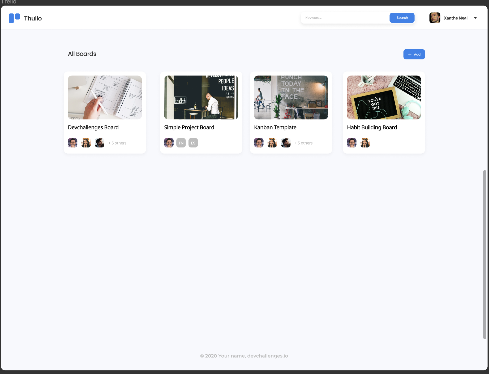
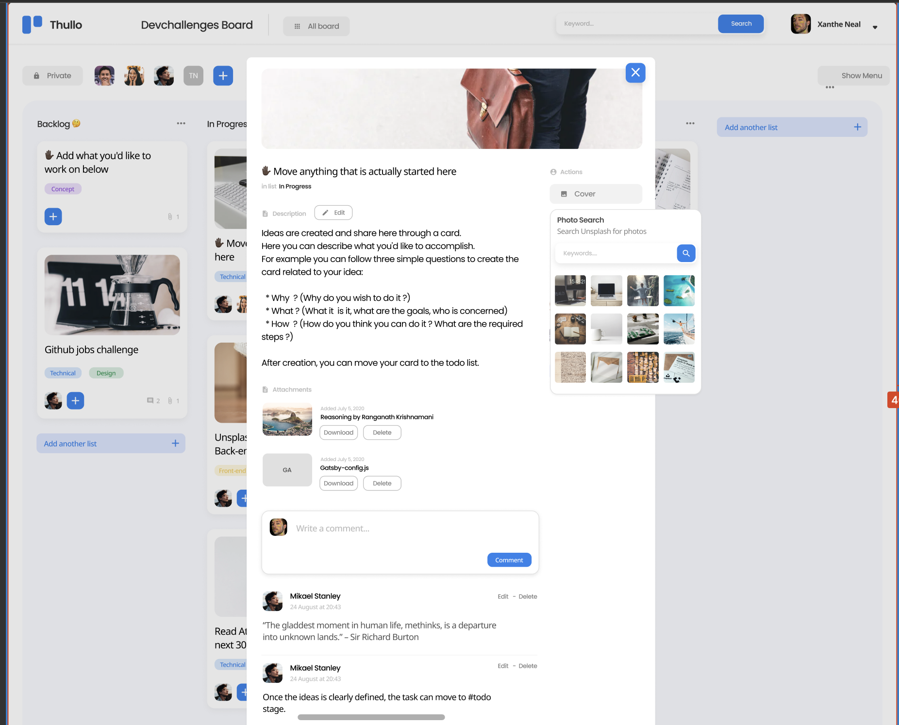
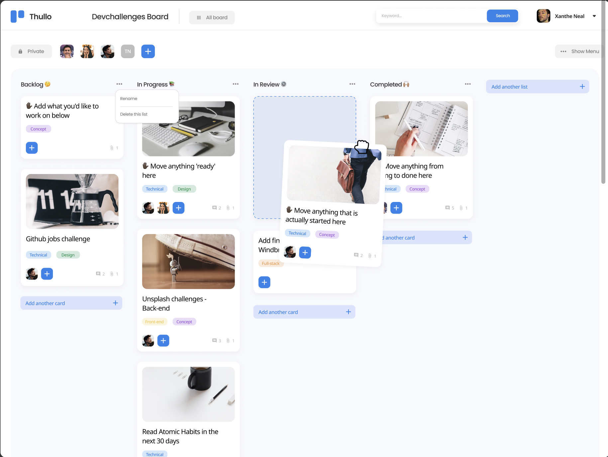

# Thullo

Thullo is a digital platform that helps individuals and organizations manage their projects effectively. It provides a range of tools and features that make it easy to plan, track, and collaborate on various tasks and deliverables.<br>
***The API documentation is hosted [here](https://documenter.getpostman.com/view/18385063/2s935mt5z6#33376033-2100-4341-9450-dd518daeec8e)***
<br>
***Live URL is hosted [thullo.com](https://thullo-web.netlify.app/login)***

## Thullo Board Layout






## Technologies Used
- Java (Programming language)
- Springboot (Framework used to develop the APIs)
- Gradle (Dependency manager)
- MySQL (Database for data storage)
- JWT (Library for authentication)
- Railway (Hosting service)
- Spring Security (Framework used for security)

## Prerequisites

To build and run this project, you'll need:

- Java JDK 11 or later
- Spring Boot 2.7.4
- Gradle 7.6


## Getting Started

To get started with THullo, you will need to clone this repository to your local machine and set up the necessary dependencies.

### Installation

# Installation

1. Clone this repository to your local machine:

    ```bash
    git clone https://github.com/your-username/thullo/thullo-backend.git
    ```

2. Create MySQL database

   ```bash
   mysql> create database thullo
   ```

3. Configure database username and password

     ```properties
       # src/main/resources/application.properties
      spring.datasource.url=jdbc:mysql://localhost:3306/thullo
      spring.datasource.username=<YOUR_DB_USERNAME>
      spring.datasource.password=<YOUR_DB_PASSWORD>
     ```

4. specify OAuth2 Provider ClientIds and ClientSecrets
   > This is optional if you're testing the app in localhost. A demo clientId and clientSecret is already specified.

   ```properties
   # src/main/resources/application.properties
   spring.security.oauth2.client.registration.google.client-id=<GOOGLE_CLIENT_ID>
   spring.security.oauth2.client.registration.google.client-secret=<GOOGLE_CLIENT_SECRET>
   spring.security.oauth2.client.registration.google.redirect-uri-template={baseUrl}/oauth2/callback/{registrationId}
   spring.security.oauth2.client.registration.google.scope=email,profile
   
   spring.security.oauth2.client.registration.facebook.client-id=<FACEBOOK_CLIENT_ID>
   spring.security.oauth2.client.registration.facebook.client-secret=<FACEBOOK_CLIENT_SECRET>
   spring.security.oauth2.client.registration.facebook.redirect-uri-template={baseUrl}/oauth2/callback/{registrationId}
   spring.security.oauth2.client.registration.facebook.scope=email,public_profile
   
   spring.security.oauth2.client.registration.github.client-id=<GITHUB_CLIENT_ID>
   spring.security.oauth2.client.registration.github.client-secret=<GITHUB_CLIENT_SECRET>
   spring.security.oauth2.client.registration.github.redirect-uri-template={baseUrl}/oauth2/callback/{registrationId}
   spring.security.oauth2.client.registration.github.scope=user:email,read:user
   
   spring.security.oauth2.client.provider.facebook.authorization-uri=https://www.facebook.com/v3.0/dialog/oauth
   spring.security.oauth2.client.provider.facebook.token-uri=https://graph.facebook.com/v3.0/oauth/access_token
   spring.security.oauth2.client.provider.facebook.user-info-uri=https://graph.facebook.com/v3.0/me?fields=id,first_name,middle_name,last_name,name,email,verified,is_verified,picture.width(250).height(250)
   ```

5. Set up the backend server:
   ```bash
      ./gradlew run
   ```


## Functional requirement

- User story: I can register a new account
- User story: I can log in
- User story: I can log in or register with at least one of the following services: Google, Facebook, Twitter or Github
- User story: I can sign out
- User story: I can see my profile details
- User story: I can edit my details including: photo, name, bio, phone, email and password
- User story: I can upload a new photo or provide an image URL
- User story: I can list of available boards
- User story: I can add a new board with a cover photo, title and visibility options
- User story: I can see a board with different columns, team members,... according to the design
- User story: I can add a new list
- User story: I can add a new card to the existing list
- User story: I can set the visibility of the board
- User story: I can add a member to the board (user must exist in the system)
- User story: I can change the name of the board by selecting it
- User story: I can change/add the description of the board
- User story: Given I am an admin, I can remove members from the board
- User story: I can move a card from a column to another one by drag and drop
- User story: When a card is selected, I can rename the title by selecting it
- User story: When a card is selected, I can see which column the card belongs to
- User story: When a card is selected, I can see and change the description
- User story: When a card is selected, I can add new attachments and I can download and delete existing attachments
- User story: When a card is selected, I can add a new comment. Given I am the author, I can edit and delete the comment.
- User story: When a card is selected, I can change the card cover image by searching from Unsplash
- User story: When a card is selected, I can add labels with given colors

## Non-Functional Requirements

The following non-functional requirements must be met:

- Security: The application must have robust security measures in place to protect user data and prevent unauthorized access.
- Availability: The application must be highly available, with minimal downtime and interruptions in service.
- Performance: The application must be optimized for low latency, with fast response times to user requests.


## Contributing

If you would like to contribute to THullo, please follow these guidelines:

1. Fork this repository to your own account
2. Create a branch for your feature: `git checkout -b feature/your-feature`
3. Commit your changes: `git commit -m "Add some feature"`
4. Push to your branch: `git push origin feature/your-feature`
5. Create a new Pull Request and describe your changes.
